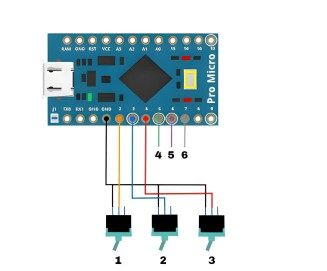

# Arduino Joystick (1.0)

**No installation required**, just upload the sketch into your Pro Micro.

This SKETCH WORKS ONLY for Arduino LEONARDO or any board with ATmegaxxu4/u2 microcontroller which has native USB support & arduino bootloader installed in it. (just buy an arduino pro micro)

***

**Author: OrbitX.Space**
